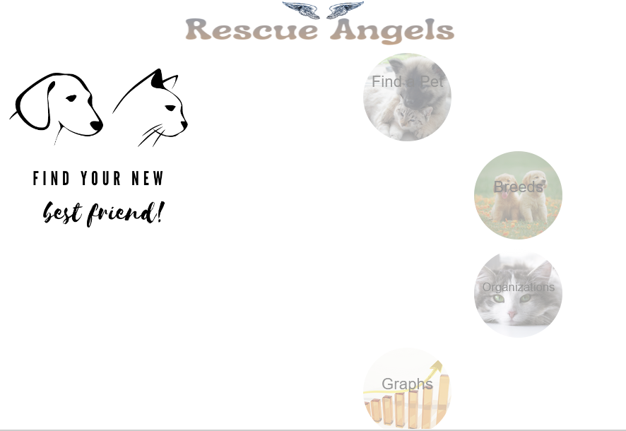
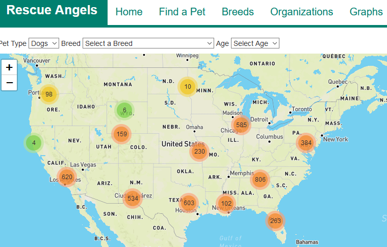
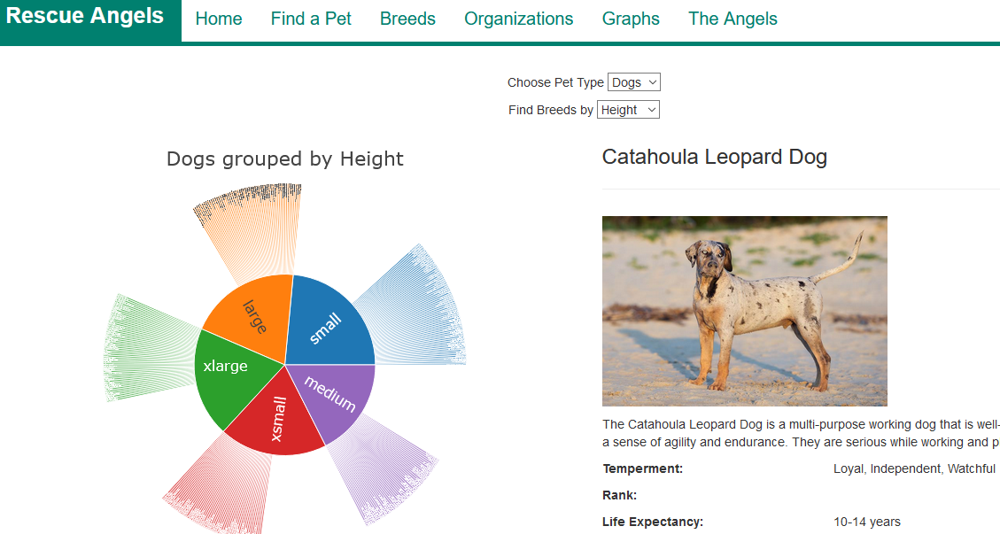
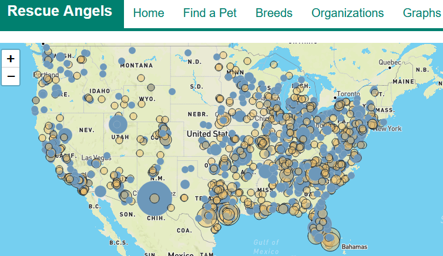

# Coding Angels - Rescue Angels
> We have created a website that helps people find their perfect lovable dog or cat & actually browse current adoption listings to source where to get a desired breed. Adopt a dog or cat - or BOTH! Check out a brief introduction to our website development, here: https://docs.google.com/presentation/d/19k5C-MS9-BizZANY5uNOPcoqSFk2wY0-2bBoFTfp9O4/edit#slide=id.p.  


## Find Your Favorite Four-legged Friend! 


## Table of contents
* [General Info](#general-info)
* [Data Sources](#data)
* [Technologies](#technologies)
* [Libraries & Dependencies](#libraries)
* [Data Processing and Cleanup](#data-processing)
* [Find-a-Pet Interactive Map Development](#find-a-pet)
* [Breeds Interactive Chart Development](#breeds)
* [Setup](#setup)
* [Features & Visualizations](#features)
* [Lessons Learned](#status)
* [Inspiration](#inspiration)
* [Contact](#contact)

## General info
### Team Members:
- [Chloe Veras](https://github.com/cveras33)
- [Deepa Vadakan](https://github.com/deepavadakan)
- [Jennifer Dean](https://github.com/Jen-Dean)
- [Jessi Volosin](https://github.com/jvolosin)
- [Kasey Lacerda](https://github.com/KLacerda08)
- [Osvaldo (Ozzie) Mauricio Moreno](https://github.com/sir-omoreno)
- [Meet the Angels](http://127.0.0.1:5000/angels)

## Data Sources
### APIs
- [PetFinder API](https://www.petfinder.com/developers/)
- [Mapbox API](https://docs.mapbox.com/api/overview/)
- [Petpy Python Wrapper](https://https://pypi.org/project/petpy//)

### Web Scraping Data
- [PetFinder](https://www.petfinder.com/)
- [American Kennel Club](https://www.akc.org/)
- [The Cat Fancier's Association](https://cfa.org/)
- [Purina](https://www.purina.com/)

### Geospatial Data
- [opendatasoft](https://public.opendatasoft.com/explore/dataset/us-zip-code-latitude-and-longitude/table/)

## Technologies
* Python
* Flask
* Javascript
* HTML/ CSS
* Bootstrap
* D3
* Plotly
* JSON
* Web APIs
* MongoDB
* Heroku

## Libraries 
**Libraries**
* [JavaScript Libraries](https://medium.com/javascript-in-plain-english/best-javascript-data-visualization-libraries-for-2020-15291919a176)
* [Bootstrap](https://getbootstrap.com/docs/4.0/getting-started/introduction/)
* [Leaflet](https://leafletjs.com/)

**Python Dependencies**
* Pandas
* Numpy
* Flask
* Flask_pymongo
* Splinter
* Selenium
* BeautifulSoup
* [Petpy](https://pypi.org/project/petpy/)
* Time
* Webdriver_manager.chrome
* Re
* Pymongo
* Pprint 
* config

**JavaScript Dependencies**
* [Leaflet JS](https://unpkg.com/leaflet@1.6.0/dist/leaflet.js)
* [Marker Cluster JS](https://unpkg.com/leaflet.markercluster@1.0.3/dist/leaflet.markercluster.js)
* [JQuery](https://code.jquery.com/jquery-3.5.1.slim.min.js)
* [D3 Javascript](https://d3js.org/d3.v6.min.js)
* [D3 Cloudfare](https://cdnjs.cloudflare.com/ajax/libs/d3-tip/0.7.1/d3-tip.min.js)
* [Ploty](https://cdn.plot.ly/plotly-latest.min.js)

**HTML CSS Dependencies**
* [Bootstrap Stylesheet](https://maxcdn.bootstrapcdn.com/bootstrap/3.3.7/css/bootstrap.min.css)
* [Leaflet Stylesheet](https://unpkg.com/leaflet@1.6.0/dist/leaflet.css)
* [Marker Cluster Stylesheet](https://unpkg.com/leaflet.markercluster@1.0.3/dist/MarkerCluster.css)

## Data Processing and Cleanup
### Selecting Data Sources 
Our initial search for data identified two primary APIs for consideration:  Petfinder (https://www.petfinder.com/developers/v2/docs/) and Rescue Groups(https://api.rescuegroups.org/v5).  We applied for API keys (and secrets, where necessary) for each, and after exploring the data returned by each, decided that Petfinder was better suited for our use.  

The Petfinder API gave information on pets available for adoption, including the following:  
- Unique Pet Information (e.g. name, weight, age, personality, etc.) 
- Pet adoption organizations 
- Two separate API calls for endpoints (animals, organization) 

We also scraped data from the sources listed in [Data Sources](#data) above, to provide overall information regarding dog and cat breeds around the world such as breed names, temperament, description, height, weight, color, coat length, life expectency, etc..  The information on cat breeds was more scattered across organizations and required additional processing to compile.  

Our initial base code included included a work-around to account for the 3600-minute time limit on the Petfinder API key/secret. However, in poking around the internet we found Petpy, a python wrapper that provided a simpler API call method:  https://pypi.org/project/petpy/. This wrapper also gave the option to 
return the API call as either a json response, or a pandas dataframe. 

Leaflet required latitude and longitude for mapping. However, our API data did not contain that information.  
Since we would need to import the latitude and longitude separately, and merge that with the zipcode field from the Petfinder API data, we opted to return the API call as a pandas dataframe.  

### Data Cleanup 
**Web Scraping Data**:
- For cat data, combined all data into one csv
- Read csvs in a new jupyter notebook (one each for dogs and cats)
- Converted data to a dictionary or list of dictionaries 
- Exported to MongoDB (cat_breeds and dog_breeds collections)

**Latitude and Longitude Data**:
- Performed quick processing in Excel (text-to-columns), saved as csv.  

**API Calls**:
- Returned two separate API calls (animals and organizations) as dataframes
- Addressed duplicated “organization_id” column from animal API call, which was critical, since our dataframes needed to be merged on that field:

my_columns = list(range(0,48))
animal2_df = animal2_df.iloc[:,my_columns]

- Renamed columns to eliminate dot notation, since mongodb does not accept dot.notation in data fields. 
- Renamed certain columns for key match on merging
- Converted data types for certain fields to string
- Read zip_lat_long.csv into Pandas and converted data types to string
- Merged lat-long and organizations dataframes 
- Merged animals and organizations/lat_long dataframe
- Exported combined dataframe to mongoDB (final_data collection)  
- Final Database: rescue_angels_db, with three collections: 
  * cat_breeds - used for sunburst map visualization
  * dog_breeds - used for sunburst map visualization
  * final_data - used for interactive mapping visualizations

## Find-a-Pet Interactive Map Development
An interactive map allows the user to view all adoptable dogs or cats across the US, filterable by breed. We coded the map in JavaScript using D3 and Leaflet. The data was called using the MAPBOX API, and map markers were populated by querying data from our MongoDB "rescue_pets_db" collection "final_data" through the flask app. 


## Breeds Interactive Chart Development
An interactive sunburst chart allows the user to find either a dog or cat breed based on three different attributes (height, weight, or group), and then displays characteristics of a particular breed. We coded the  interactive chart in JavaScript, using D3 and Plotly.  The data was sourced from the AKC for dogs, and from a combined dataset for cats (Petfinder, Purina, and CFA).  


## Organizations Interactive Map
An interactive map allows the user to view the organizations across the country where pets are adoptable, including a link to that organization's webpage, the number of pets available at that location, and the average age of their pets.  The size of each marker is related to the number of adoptable cats and/or dogs that organization has, and the color is the average age of the pets.
We coded this in JavaScript using D3 and Leaflet; we used binning to group the number of pets for the marker size.  The data was sourced from our MongoDB "rescue_pets_db" collection "final_data". 


## Setup
0) install `pip install petpy` to your environment
1) install 'pip install dnspython' to your environment
2) set up a local config.py file with your PetFinder.com `API_key` and `API_secret`
3) set up a config.js file with your `MAPBOX_API_KEY` within "static/js" folder
4) Run file:```AKC_Scraping/dog_breeds_mongo_db.ipynb``` here: https://github.com/deepavadakan/project-2/tree/main/AKC_Scraping to create the dog_breeds collection in MongoDB
5) Run file ```Cat_breeds_scrape/cat_breeds_mongo_db.ipynb``` here: https://github.com/deepavadakan/project-2/tree/main/Cat_breeds_scrape to create the cat_breeds collection in MongoDB
6) Run and RESTART the Kernal from file ```create_collections.ipynb``` here: https://github.com/deepavadakan/project-2/tree/main/MongoDB_Creation/  to create the final_data collection, which contains results from two petfinder API calls to the API endpoints "animals" and "organizations".  
7) Run `python app.py` to open the flask web application

## Features & Visulizations
### Find a Pet

* Navigate here: http://127.0.0.1:5000/find-a-pet
* USA Map of Current Adoption availabilites based on location, breed, etc. Use the dropdown menus to select dog or cat, your desired breed, and age. The map of the USA will update with locations of your desired pet, if available! 

### Explore Breeds 

* Navigate here: http://127.0.0.1:5000/breeds/
* Use the dropdowns to select your pet type criteria (dog or cat), and search criteria (height, weight, or (breed) group).   
* Select from the outer ring of the sunburst chart and a photo will popup, showing a typical example of that breed and additional information such as height, weight, color, temperament, life expentancy, and more.  

### Find an Organization

* Navigate here: http://127.0.0.1:5000/organizations
* Zoom in on the map to your desired location and click on a circle to see a link that organization's website, the number of adoptable pets, and the median pet age.  

### Pet Statistics 
* Navigate here: http://127.0.0.1:5000/graphs
If you want to checkout some additional information on available pets - to guide your search or just for fun - checkout our stats on available pets by state, breed, age, and gender:  

#### Pets by State

#### Pets by Age

#### Pets by Breed (Use the Scrollbar!)

#### Pets by Gender


## Inspiration
Inspired by Rutgers Data Visulization Bootcamp & Fluffy animals everywhere!

## Contact
Created by:
- [Chloe Veras](https://github.com/cveras33)
- [Deepa Vadakan](https://github.com/deepavadakan)
- [Jennifer Dean](https://github.com/Jen-Dean)
- [Jessi Volosin](https://github.com/jvolosin)
- [Kasey Lacerda](https://github.com/KLacerda08)
- [Osvaldo (Ozzie) Mauricio Moreno](https://github.com/sir-omoreno)
